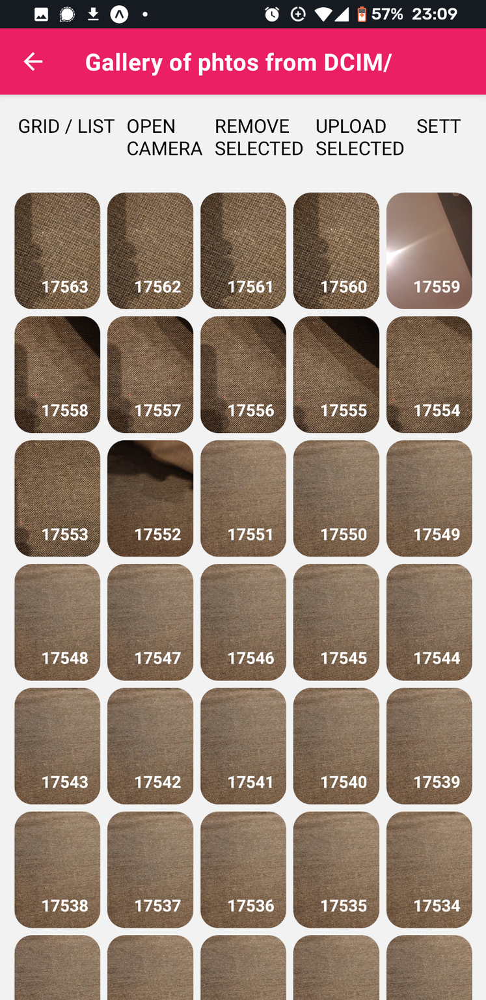
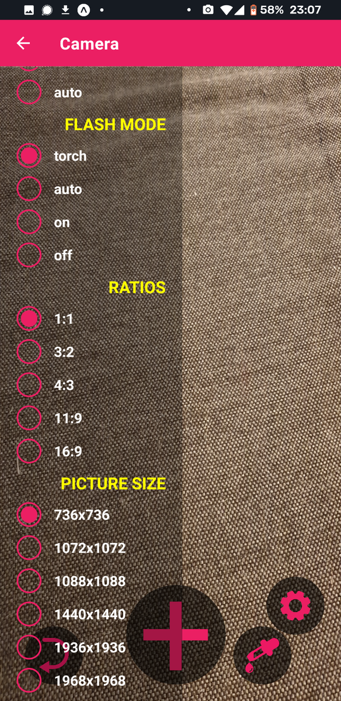
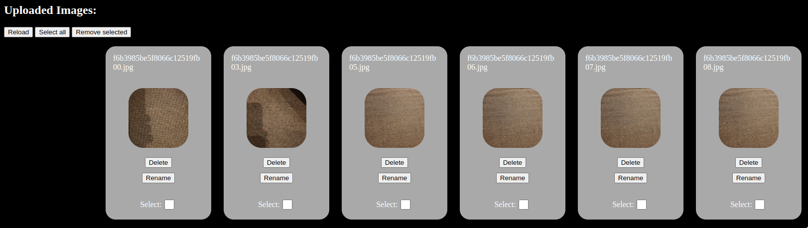

# React Native Gallery + Camera App
Features:
- See all your photos in gallery
- Remove unwanted files
- Take a new photo
- Adjust settings of camera while photographing
- Send files to server
- See uploaded files

## To start:
- Run `npm install`
- Run `expo start`
- In another terminal `cd backend && ./start`
- In app go to settings and set your computer IP address

